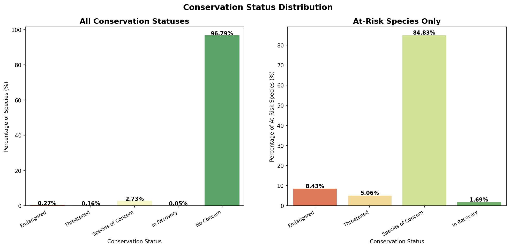
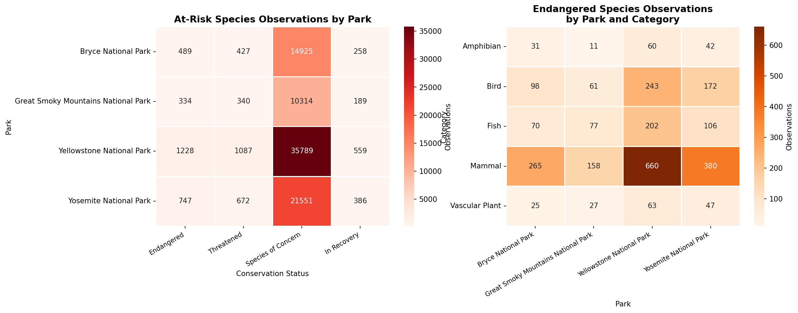
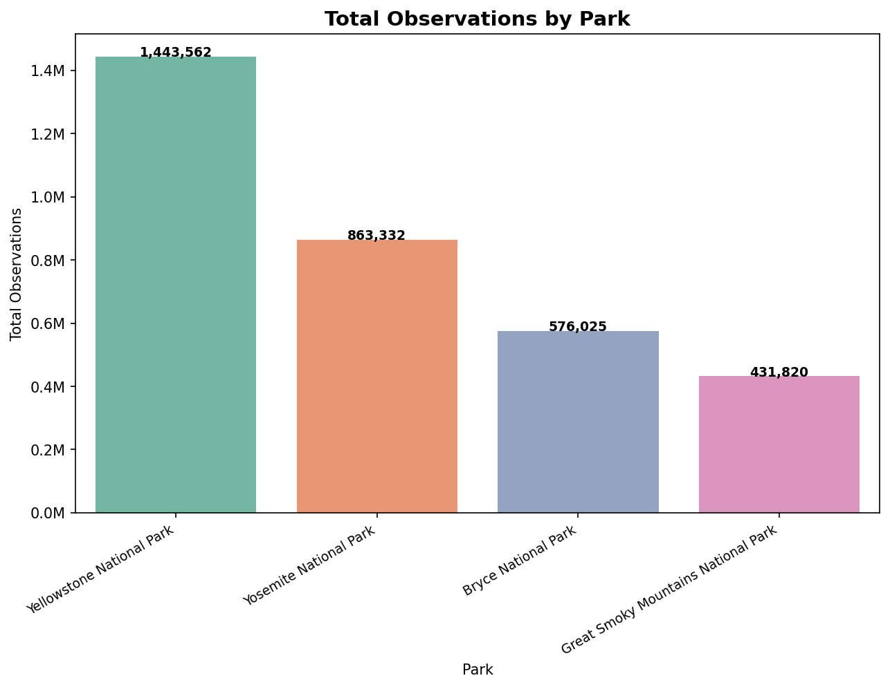

# Biodiversity in U.S. National Parks

Exploratory data analysis of species conservation status and wildlife observations across four U.S. national parks: **Yellowstone, Yosemite, Great Smoky Mountains, and Bryce Canyon**.

## Key Findings

- **96% of species show no conservation concern** — but the remaining 4% tell a critical story. Among at-risk species, *Species of Concern* is the most common status, followed by Threatened and Endangered.
- **Birds face the greatest threat.** They have the highest number of at-risk species across all conservation categories, followed by Vascular Plants and Mammals. Fish, despite lower observation counts, carry a disproportionately high share of endangered classifications.
- **A small group is already recovering.** The *In Recovery* category, while the smallest, shows that active conservation efforts produce measurable results.
- **Parks differ significantly in at-risk sightings.** Some parks record far more observations of endangered species than others — a pattern that likely reflects both ecosystem diversity and monitoring intensity rather than conservation status alone.
- The dataset covers **5,824 species** across 4 parks, with conservation status recorded for only 191 of them — highlighting how much of the picture remains unknown.

## Overview

This project analyzes two datasets from the National Park Service:

- `species_info.csv` — 5,824 species with their biological category, scientific name, common names, and conservation status
- `observations.csv` — wildlife sighting counts per species per park

The analysis explores which species are at risk, which biological categories are most vulnerable, and how observation patterns vary across parks.

## Visualizations

| Chart | Description |
|-------|-------------|
| Conservation status distribution | All species vs. at-risk species breakdown |
| At-risk species by category | Which biological groups face the most risk |
| Observations by park | Total wildlife sightings per national park |
| At-risk observations heatmap | Conservation status × park sighting counts |
| Endangered species by park & category | Where endangered species are being observed |

## Visualizations

### Conservation Status Distribution


### At-Risk Species by Biological Category


### Observations by Park


## Project Structure

```
biodiversity/
├── README.md
├── biodiversity.ipynb       # main analysis notebook
├── species_info.csv         # species and conservation status data
└── observations.csv         # wildlife sighting counts by park
```

## How to Reproduce

1. Clone the repository:
   ```bash
   git clone https://github.com/your-username/biodiversity.git
   ```

2. Install dependencies:
   ```bash
   pip install pandas matplotlib seaborn numpy
   ```

3. Open and run `biodiversity.ipynb` in Jupyter Notebook or JupyterLab

## Data Dictionary

**species_info.csv**

| Column | Description |
|--------|-------------|
| `category` | Biological category (Mammal, Bird, Fish, etc.) |
| `scientific_name` | Species scientific name |
| `common_names` | Common name(s) |
| `conservation_status` | IUCN-style status: Endangered, Threatened, Species of Concern, In Recovery, or NaN (no concern) |

**observations.csv**

| Column | Description |
|--------|-------------|
| `scientific_name` | Species scientific name |
| `park_name` | National park where the observation was recorded |
| `observations` | Number of sightings in the past 7 days |

## Tools

- **Python 3** — pandas, numpy, matplotlib, seaborn
- Jupyter Notebook
